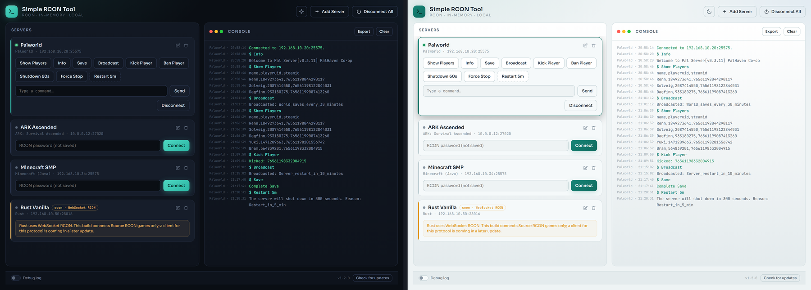

# Simple RCON Tool

A standalone desktop tool to send game-server RCON commands. Pick a game, fill in the host and port, type the RCON password when you connect, and use one-tap command buttons or a free command box. The interface is a clean web-style window.

Built by [JDE-Projects](https://github.com/JDE-Projects).

If you enjoyed this project and would like to buy me a coffee, check out my [Ko-fi](https://ko-fi.com/jdeprojects).

## Preview

<p align="center">
  
  <br><em>Dark and light themes</em>
</p>

## Highlights

- **Game catalog with built-in commands.** Choose a game when adding a server and it loads a set of verified RCON command buttons for that game.
- **Passwords are never saved.** The RCON password is held in memory only and wiped on disconnect. Only the name, host, port, game, and any custom buttons are written to `servers.json`.
- **Custom buttons on top of the built-ins.** Add your own label and command pairs per server.
- **Multiple servers at once.** Each server card connects independently.
- **Console with export.** Timestamped, per-server output, with a one-click export to a text file.
- **Update check.** Checks the GitHub Releases page and points you to a newer version when one is published.

## How it works

- The backend is a small Source RCON client using only the Python standard library (`socket`, `struct`).
- The window is a [pywebview](https://pywebview.flowrl.com/) host on the Qt backend (PySide6), with the UI in `simple_rcon_tool-UI.html`. Fonts (Sora, JetBrains Mono) are bundled locally in `fonts/`, so the look holds with no internet.
- The built-in buttons come from a catalog inside `simple_rcon_tool.py`, so updating that file updates everyone's buttons without touching their saved servers.

## Download and run

Two ways to get it from the [Releases](../../releases) page - pick one:

- **Installer (recommended):** download `SimpleRCONTool-vX.Y.Z-setup.exe` and run
  it. Installs the app, adds a Start menu shortcut, and can be removed later from
  Add or Remove Programs. Installs just for you by default (no admin); you can
  choose all users during setup.
- **Portable .zip:** download `SimpleRCONTool-vX.Y.Z.zip`, extract it, and run
  `Simple RCON Tool.exe` from inside the extracted folder. No install - good for a
  locked-down PC or a USB stick. Keep the folder together.

Windows only, no Python or setup required. Unsigned, so SmartScreen may warn the
first time: **More info > Run anyway**.

## Updating

Simple RCON Tool doesn't update itself. The bottom bar has a **Check for updates** button that tells you when a newer release is out; when it does, get the new version from the [Releases](../../releases) page the same way you first installed it.

- **Installer:** download the new `SimpleRCONTool-vX.Y.Z-setup.exe` and run it. It installs over your current copy and keeps your saved servers and theme choice.
- **Portable .zip:** download and extract the new `SimpleRCONTool-vX.Y.Z.zip`. To keep your saved servers, copy `servers.json` (and the theme `.pref` file, if present) from the old folder into the new one.

Your RCON passwords are never stored, so there's nothing else to carry over.

## Build from source (optional)

If you would rather run or build it yourself, you need:

- **Python 3** on the machine's PATH.
- Python packages: `pywebview`, `PySide6`, `pyinstaller`. Keep `PyQt6` uninstalled so PySide6 is the bundled binding.

```
pip install pywebview PySide6 pyinstaller
```

Keep `simple_rcon_tool.py`, `simple_rcon_tool-UI.html`, the `fonts/` folder, `simple_rcon_tool.ico`, `simple_rcon_tool.png` and `simple_rcon_tool-splash.png` together. Then either:

- **Run from source:** `python simple_rcon_tool.py`
- **Build the .exe:** double-click `Build_Simple_RCON_Tool.bat`, which uses PyInstaller to produce `dist\Simple RCON Tool\Simple RCON Tool.exe`. Distribute the whole `Simple RCON Tool` folder.

## Using it

1. Click **Add Server**, pick the game, give it a display name, then enter the host and the RCON port from your server.
2. On the server card, type the RCON password and click **Connect**.
3. Use the built-in buttons, add your own, or type any command in the box. A command with `{arg}` asks for a value first. Buttons marked for confirmation ask before firing.
4. **Export** saves the console to a text file next to the app. **Disconnect** clears the password from memory.

## Supported games

These connect today over Source RCON:

- ARK: Survival Evolved
- ARK: Survival Ascended
- Conan Exiles
- Palworld
- Minecraft (Java)
- Counter-Strike 2
- Project Zomboid
- Factorio
- Squad
- Garry's Mod
- Eco (test entry, loosely Source-compatible)
- Windrose (requires the community WindroseRCON mod)
- Valheim (requires the ValheimRcon mod, crossplay off)

A few quirks worth knowing:

- **Palworld** commands are case-sensitive, and Broadcast cannot contain spaces (the app auto-converts spaces to underscores).
- **Eco** kick and ban take a `Name,Reason` value.
- **Valheim** and **Windrose** need their RCON mod loaded on the server; the editor shows that note when you pick them.

## Roadmap

The catalog also lists games that use other protocols. They appear in the picker but are gated at connect until their client is added:

- **Rust** (WebSocket RCON)
- **7 Days to Die** (Telnet)
- **Soulmask** (Telnet)
- **DayZ** (BattlEye RCON)
- **Satisfactory** (HTTPS API)

## Security and privacy

- The RCON password is never written to disk.
- `servers.json` holds only the name, host, port, game key, and custom buttons. Keep it out of source control, since it maps your internal hosts and ports.
- The debug log is off by default. When you turn it on, it writes one `Debug_Log_*.txt` next to the app for that run, with no credentials in it.

## A note on how this was built

This project was built with AI assistance. The design decisions, feature direction, game and command research targets, and real-world testing were directed by me. The code was written and revised with an AI assistant against that direction. Treat it like any community tool, review and test it before relying on it.

## License

Released under the [PolyForm Noncommercial License 1.0.0](LICENSE). Personal and any noncommercial use, modification, and noncommercial redistribution are allowed; commercial use is not. Keep the copyright notice; no warranty.

This build bundles third-party code (Qt via PySide6, pywebview, and the Sora and JetBrains Mono fonts). Their notices are in [THIRD-PARTY-LICENSES.txt](THIRD-PARTY-LICENSES.txt).

For commercial licensing, open a [GitHub issue](https://github.com/JDE-Projects/Simple-RCON-Tool/issues) with the title "Commercial License Inquiry".
